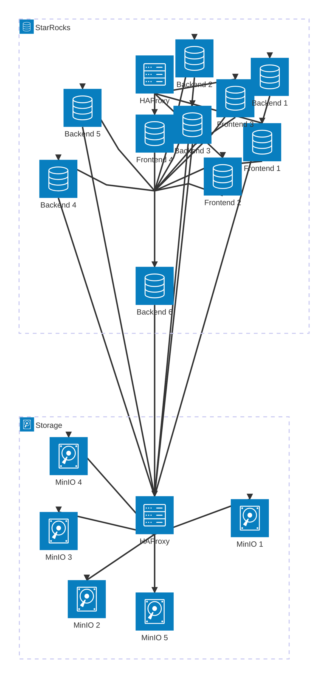

# StarRocks Minio Cluster inside Docker Compose

Simple StarRocks and MinIO cluster inside Docker Compose.

This example is based on the [StarRocks documentation](https://docs.starrocks.io/docs/quick_start/shared-data/), and [StarRocks repository](https://github.com/StarRocks/demo/tree/master/documentation-samples)

## Disclaimer

This repository is created by [Khiem Doan](https://github.com/khiemdoan) for educational purposes only. It is not an official StarRocks or MinIO project.

This is a simple setup for development and testing purposes. It is not intended for production use.

I do not take any responsibility for any issues that may arise from using this setup in production.

## Components



- StarRocks Frontend: 4 nodes (with HAProxy as load balancer)
- StarRocks Backend: 6 nodes
- MinIO: 5 nodes (with HAProxy as load balancer)


## Running

1. Run `mkdirs.sh` to create necessary directories.
1. Create a `.env` file in the follow `.env.example` file.
1. Start compose

    ```bash
    docker compose up -d
    ```

1. After the containers are up, you should change password for the `root` user in StarRocks.

    ```sh
    docker exec -it starrocks-leader bash
    mysql -P9030 -h 127.0.0.1 -u root --prompt="StarRocks > " -p
    # without password
    ```

1. Then run the following SQL command to change the password, for example:

    ```sql
    SET PASSWORD = PASSWORD('$w0rdf1sh');
    ```

1. Add compute nodes

    ```sql
    ALTER SYSTEM ADD COMPUTE NODE "starrocks-cn-1:9050";
    ALTER SYSTEM ADD COMPUTE NODE "starrocks-cn-2:9050";
    ALTER SYSTEM ADD COMPUTE NODE "starrocks-cn-3:9050";
    ALTER SYSTEM ADD COMPUTE NODE "starrocks-cn-4:9050";
    ALTER SYSTEM ADD COMPUTE NODE "starrocks-cn-5:9050";
    ALTER SYSTEM ADD COMPUTE NODE "starrocks-cn-6:9050";
    ```

## Create database

You can create a database using the following SQL command:

```sql
CREATE DATABASE IF NOT EXISTS warehouse;
```

## Accessing services

- MySQL: `localhost:9030`
- StarRocks: [http://localhost:8030](http://localhost:8030)
- MinIO: [http://localhost:9000](http://localhost:9000)

